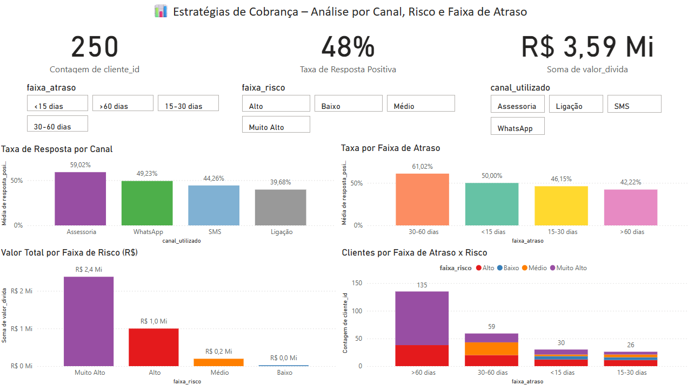
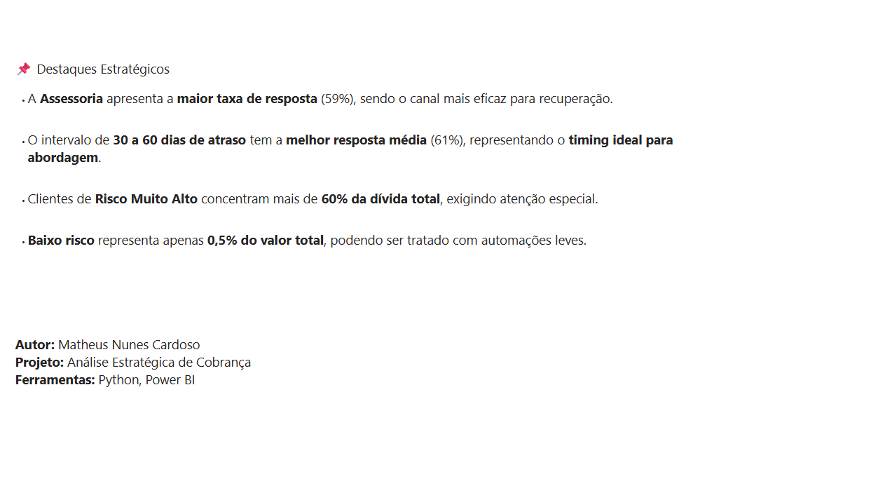

# 📊 Análise Estratégica de Cobrança com Power BI

Este projeto simula uma base de dados de inadimplência para construção de um **dashboard estratégico de cobrança**, com o objetivo de identificar os canais mais eficazes, o melhor momento para abordagem e o perfil de risco dos devedores. A solução final foi construída utilizando **Python**, **Power BI** e princípios de análise de dados com foco em **decisão de negócio**.

---

## 📌 Objetivo

Desenvolver um painel analítico que auxilie equipes de cobrança a:
- Identificar os **canais mais efetivos**
- Entender **qual faixa de atraso gera maior resposta**
- Avaliar a **distribuição da dívida por risco**
- Direcionar esforços para **clientes com maior potencial de recuperação**

---

## 🛠️ Ferramentas Utilizadas

- **Python**: Geração da base de dados fictícia (simulação via script)
- **SQLite + pandas**: Exportação de dados como se extraídos de um banco relacional
- **Excel (Power Query)**: Ajustes finais no `.csv`
- **Power BI Desktop**: Modelagem visual, segmentadores, KPIs e storytelling analítico

---

## 🗂️ Estrutura do Projeto

```
📁 data/
    └── clientes_enriquecido.csv
📁 scripts/
    ├── gerar_base.py
    └── analise_dados.py
📁 imagens/
    ├── img_dashboard.png
    └── img_resumo.png
📄 painel.pbix
📄 README.md
```

---

## 🔍 Processo de Construção

### 1. **Simulação da base**
Foi criado um script em Python para gerar dados realistas de inadimplência, contendo:
- Identificação do cliente
- Canal de cobrança
- Dias em atraso
- Valor da dívida
- Resposta do cliente
- Faixa de risco

### 2. **Exportação SQL simulada**
O script `exportar_csv.py` executa uma query `.sql` sobre o DataFrame e exporta os dados enriquecidos em `.csv`.

### 3. **Limpeza e enriquecimento**
Usamos Power Query (Excel e Power BI) para:
- Corrigir codificação de caracteres
- Converter valores monetários
- Criar novas colunas: faixa de atraso, grupo de canal, valor em faixas, resposta binária

### 4. **Visualização no Power BI**
O dashboard foi construído com:
- KPIs principais (número de clientes, taxa de resposta, valor total de dívida)
- Gráficos de barra e colunas por canal, risco e atraso
- Segmentadores de filtro para navegação dinâmica
- Página 2 com resumo estratégico

---

## 📈 Visual do Painel

### Página 1 – Dashboard Interativo



---

### Página 2 – Resumo Estratégico



---

## 📌 Destaques Estratégicos

- A **Assessoria** apresenta a **maior taxa de resposta** (59%), sendo o canal mais eficaz para recuperação.

- O intervalo de **30 a 60 dias de atraso** tem a **melhor resposta média** (61%), representando o **timing ideal para abordagem**.

- Clientes de **Risco Muito Alto** concentram mais de **60% da dívida total**, exigindo atenção especial.

- **Baixo risco** representa apenas **0,5% do valor total**, podendo ser tratado com automações leves.

---

## 👨‍💻 Autor

**Matheus Nunes Cardoso**  
📧 Email: mtsnunescardoso@gmail.com  
🔗 LinkedIn: [www.linkedin.com/in/matheus-nunes-cardoso-3b3635186](https://www.linkedin.com/in/matheus-nunes-cardoso-3b3635186)

---

## 📎 Licença

Este projeto é de uso livre para fins educacionais e demonstração profissional.
