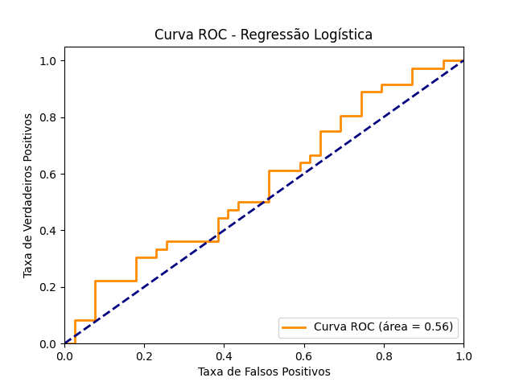
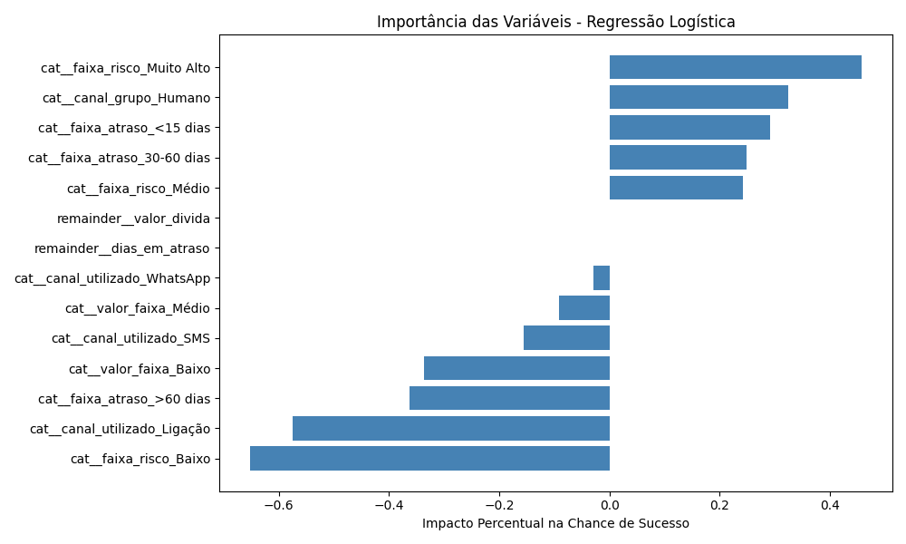
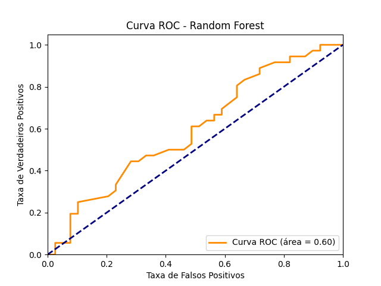
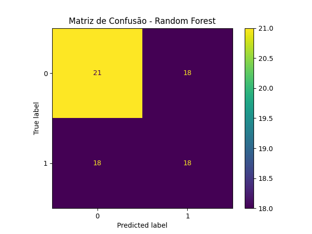
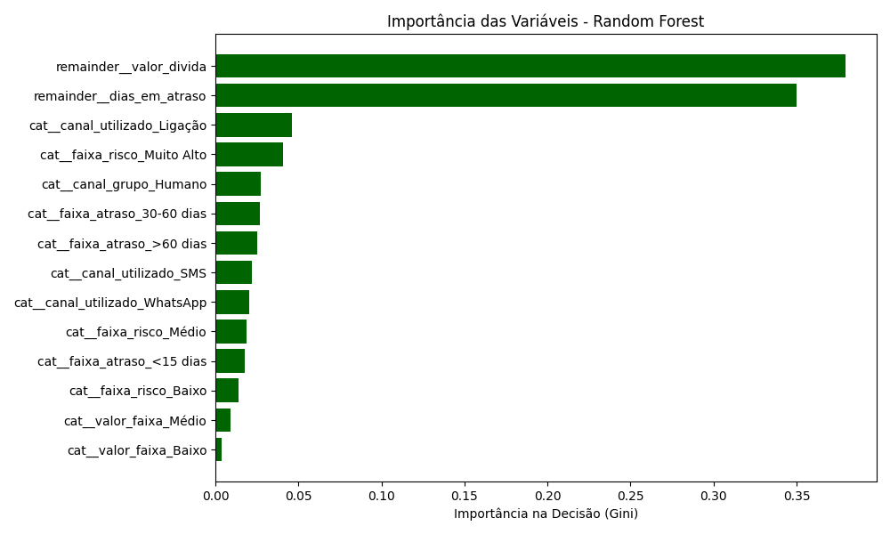
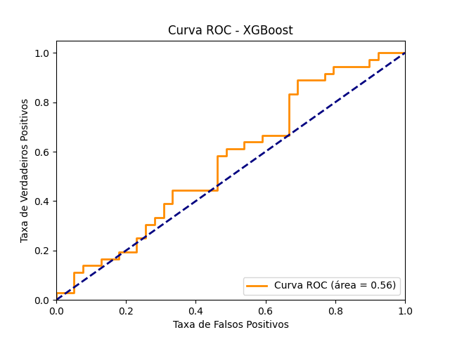
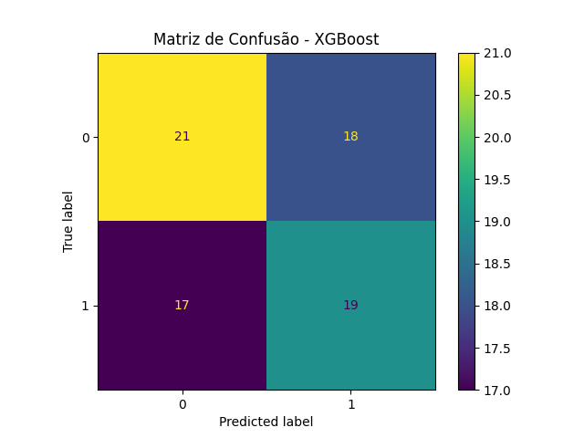
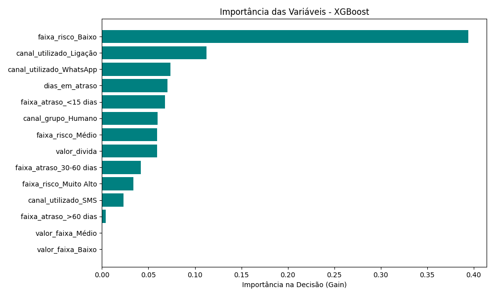
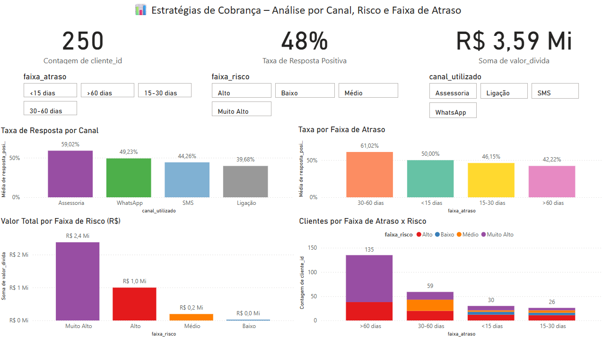

# 📊 Análise Estratégica de Cobrança com Power BI + Modelos Preditivos

Este projeto simula uma base de dados de inadimplência para construção de um **dashboard estratégico de cobrança**, com o objetivo de identificar os canais mais eficazes, o melhor momento para abordagem e o perfil de risco dos devedores. A solução final foi construída utilizando **Python**, **Power BI** e técnicas de **Machine Learning**, com foco em **decisão de negócio orientada a dados**.

---

## 📌 Objetivo

Desenvolver um painel analítico e modelos preditivos que auxiliem equipes de cobrança a:
- Identificar os **canais mais efetivos**
- Entender **qual faixa de atraso gera maior resposta**
- Avaliar a **distribuição da dívida por risco**
- Prever **clientes com maior probabilidade de responder positivamente à cobrança**

> ⚠️ **Nota Importante**: Os modelos preditivos aqui desenvolvidos apresentaram desempenho próximo ao acaso (AUC em torno de 0.56–0.60). Isso indica **limitações nas variáveis disponíveis** para previsão efetiva do comportamento de pagamento. Para aplicação prática em estratégias de cobrança, seria necessária a inclusão de dados adicionais como:
> - Histórico real de pagamentos
> - Número e tipo de interações prévias
> - Promessas quebradas
> - Tempo médio de resposta
> - Análise de sentimento nas mensagens

---

## 🛠️ Ferramentas Utilizadas

### Linguagens e Frameworks
- **Python 3.11+**: Linguagem principal para processamento de dados e ML
- **pandas**: Manipulação e análise de dados
- **scikit-learn**: Implementação de algoritmos de machine learning
- **XGBoost**: Algoritmo de gradient boosting para classificação
- **matplotlib**: Visualização de dados e métricas de modelo

### Ferramentas de BI e Visualização
- **Power BI Desktop**: Dashboard interativo e storytelling analítico
- **Power Query**: Transformação e limpeza de dados
- **Excel**: Ajustes finais e validação de dados

### Infraestrutura de Dados
- **CSV**: Formato de armazenamento para dados estruturados
- **joblib**: Serialização e persistência de modelos treinados
- **Pipeline sklearn**: Orquestração de pré-processamento e modelagem

---

## 📁 Estrutura do Projeto

```
projeto-cobranca-python-powerbi/
├── 📁 data/                              # Dados processados e transformados
│   ├── clientes_enriquecido.csv         # Dataset principal com features engenheiradas
│   ├── X_treino.csv                     # Features de treino (dados originais)
│   ├── X_teste.csv                      # Features de teste (dados originais)
│   ├── X_treino_transformado.csv        # Features de treino (pós one-hot encoding)
│   ├── X_teste_transformado.csv         # Features de teste (pós one-hot encoding)
│   ├── y_treino.csv                     # Target de treino
│   └── y_teste.csv                      # Target de teste
├── 📁 scripts/                          # Scripts Python para processamento e ML
│   ├── gerar_base.py                    # Geração de dados sintéticos
│   ├── analise_dados.py                 # Feature engineering e enriquecimento
│   ├── pipeline_etl.py                  # Pipeline de ETL e pré-processamento
│   ├── regressao_logistica.py           # Modelo de regressão logística
│   ├── random_forest.py                 # Modelo Random Forest
│   └── modelo_xgboost.py                # Modelo XGBoost
├── 📁 modelo_regressao_logistica/       # Artefatos do modelo de regressão logística
│   ├── modelo.pkl                       # Modelo serializado
│   ├── matriz_confusao.png              # Matriz de confusão
│   ├── curva_roc.png                    # Curva ROC
│   ├── impacto_features.csv             # Importância das features
│   └── coeficientes_impacto_features.png # Visualização dos coeficientes
├── 📁 modelo_random_forest/             # Artefatos do modelo Random Forest
│   ├── modelo.pkl                       # Modelo serializado
│   ├── matriz_confusao.png              # Matriz de confusão
│   ├── curva_roc.png                    # Curva ROC
│   ├── impacto_features.csv             # Importância das features (Gini)
│   └── GINI_impacto_features.png        # Visualização da importância
├── 📁 modelo_xgboost/                   # Artefatos do modelo XGBoost
│   ├── modelo.pkl                       # Modelo serializado
│   ├── matriz_confusao.png              # Matriz de confusão
│   ├── curva_roc.png                    # Curva ROC
│   ├── impacto_features.csv             # Importância das features (Gain)
│   └── GAIN_impacto_features.png        # Visualização da importância
├── 📁 imagens/                          # Assets visuais do dashboard
│   ├── img_dashboard.png                # Screenshot do dashboard principal
│   └── img_resumo.png                   # Screenshot da página de resumo
├── 📄 painel.pbix                       # Arquivo do Power BI
├── 📄 requirements.txt                  # Dependências Python
├── 📄 .gitignore                        # Arquivos ignorados pelo Git
└── 📄 README.md                         # Documentação do projeto
```

---

### Fluxo de Dados

O projeto segue um pipeline estruturado de processamento de dados:

1. **Geração de Dados Sintéticos** (`gerar_base.py`)
   - Simula base realística de inadimplência com 250 registros
   - Inclui variáveis como nome, dias em atraso, valor da dívida, canal utilizado, resposta do cliente e faixa de risco

2. **Feature Engineering** (`analise_dados.py`)
   - Criação de faixas de atraso categóricas
   - Binarização de respostas positivas
   - Agrupamento de canais (Digital vs Humano)
   - Categorização de valores em faixas

3. **Pipeline ETL** (`pipeline_etl.py`)
   - Separação treino/teste estratificada (70/30)
   - One-hot encoding para variáveis categóricas
   - Tratamento de valores ausentes
   - Padronização de features numéricas

4. **Modelagem Preditiva** (múltiplos scripts)
   - Treinamento de três algoritmos diferentes
   - Avaliação comparativa de performance
   - Geração de métricas e visualizações

5. **Visualização e BI** (Power BI)
   - Dashboard interativo com KPIs principais
   - Análise exploratória por segmentos
   - Storytelling analítico para tomada de decisão
   
---

## 📉 Modelos Preditivos Aplicados

### 🔹 Regressão Logística

- Interpretação baseada em **coeficientes log-odds** (direcional)
- Score: AUC = 0.56

**📊 Gráficos:**
- 
- 
- 

---

### 🔹 Random Forest

- Importância medida por **Gini Importance**
- Score: AUC = 0.60

**📊 Gráficos:**
- 
- 
- 

---

### 🔹 XGBoost

- Importância medida por **Gain** (aumento médio no split)
- Score: AUC = 0.56

**📊 Gráficos:**
- 
- 
- 

**📊 Comparativo de Performance dos Modelos**

Modelo	AUC-ROC	F1-Score	Precisão	Recall
Regressão Logística	0.56	0.50	0.50	0.50
Random Forest	0.60	0.50	0.50	0.50
XGBoost	0.56	0.52	0.53	0.53

📌 Interpretação Estratégica
Random Forest obteve o maior AUC-ROC (0.60), sugerindo leve vantagem na separação de inadimplentes.

XGBoost apresentou melhor equilíbrio entre precisão, recall e F1-score.

Todos os modelos ficaram próximos do limiar aleatório (AUC ~0.5), indicando que a base atual não possui variáveis suficientes para generalizar padrões de inadimplência com confiança.

Apesar da performance fraca, a estrutura do pipeline e os testes comparativos representam uma prova de conceito sólida. Com dados adicionais (ex: histórico de pagamento, tempo de resposta, tentativas de contato, etc.), o modelo pode se tornar viável para orientar estratégias de cobrança reais.

📌 Conclusão:
Embora os modelos tenham sido implementados corretamente, seus resultados evidenciam a necessidade de enriquecimento de dados para aumentar o poder preditivo. Eles são úteis como prova de conceito, mas ainda não são confiáveis para orientar decisões reais de cobrança.

---

## 📈 Visual do Painel no Power BI

### Página 1 – Dashboard Interativo



### Página 2 – Resumo Estratégico


---

## 📌 Destaques Estratégicos

- A **Assessoria** apresenta a **maior taxa de resposta** (59%), sendo o canal mais eficaz para recuperação.
- O intervalo de **30 a 60 dias de atraso** tem a **melhor resposta média** (61%).
- Clientes de **Risco Muito Alto** concentram mais de **60% da dívida total**.

---

## 👨‍💻 Autor

**Matheus Nunes Cardoso**  
📧 Email: mtsnunescardoso@gmail.com  
🔗 [LinkedIn](https://www.linkedin.com/in/matheus-nunes-cardoso-3b3635186)

---

## 📎 Licença

Este projeto é de uso livre para fins educacionais e demonstração profissional.
